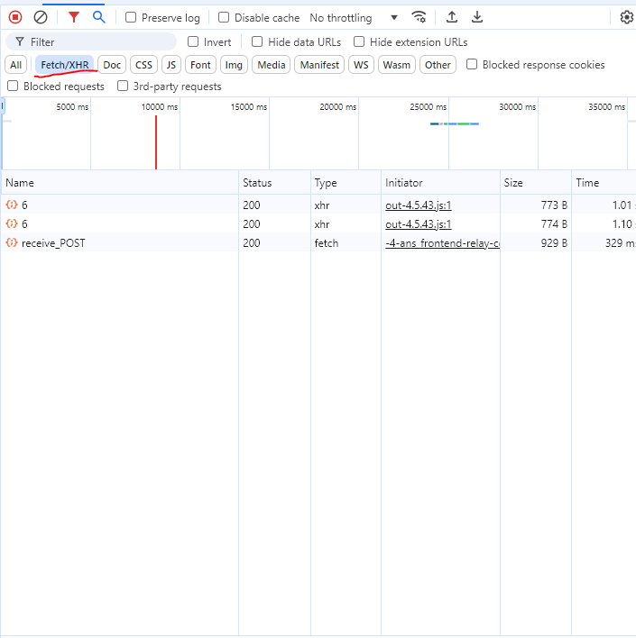
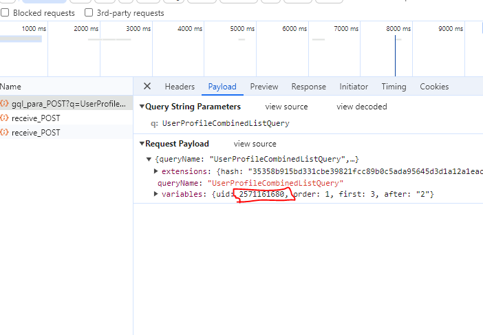

# Quora_cat
This is discord bot that used to fetch new answer from user profile and send them in discord channel
## Command are
this it the list of command that you can use for this bot
```
qr!set   => to set channel where bot post
qr!role @role => to set role to ping 
qr!add profile_name profile_id => to add profile that the bot should post his new answers
qr!remove profile_name  => to remove profile so you don't get new answer from his profile
```
## Utility
this bot used for upvote quora answer from users you can create channel where the bot send answer link and peoples go to them and upvote them

## limitation
this bot use quora private api so it may need some change if it got detected or their api got updated also to make it undetectable i made small time gap between each time the bot check for answer
so bot may jum some answer if time between them was smaller then time interval

## finding quora profile and id
to find is of quora profile follow those steps  
1- go to user profile and open inspect tool  
2- go to the network and chose Fetch/XHR  
  
3- scroll down on the quora page you will see new request sent to load more content click the request  
4- go to playload you will find the uid there (the profile id)  

